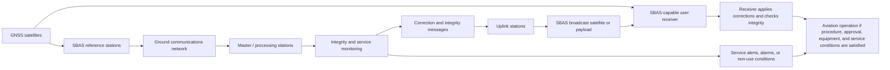

# SBAS Architecture Flow

## Scope

This page provides a compact flow representation of the SBAS architecture. It is intended as a navigation aid for readers moving between [[What is SBAS]], [[SBAS Architecture]], [[SBAS Integrity]], and aviation operations pages.

## Functional flow

## How to read the diagram

The diagram has two simultaneous paths:

1. **Correction path:** observations are processed into augmentation messages that improve user positioning.
2. **Integrity path:** monitoring and bounding determine whether the augmented solution should be used for the intended operation.

For aviation, the integrity path is not optional. SBAS-supported operations depend on the receiver and operational context determining that the navigation solution remains within the applicable bounds.

## Key interpretation cautions

- A broadcast signal alone does not equal operational approval.
- A technically capable receiver does not equal procedure availability.
- Regional coverage does not guarantee local runway minima.
- Research or testbed results do not automatically become certified operational service.
- Ionospheric threat discovery supports service design and validation; it is not itself an operational SBAS correction model.

## See also

- [[What is SBAS]]
- [[SBAS Architecture]]
- [[SBAS Integrity]]
- [[Protection Levels]]
- [[Alert Limits]]
- [[SBAS in Civil Aviation MOC]]
- [[ASEAN SBAS Service-Model Options]]
